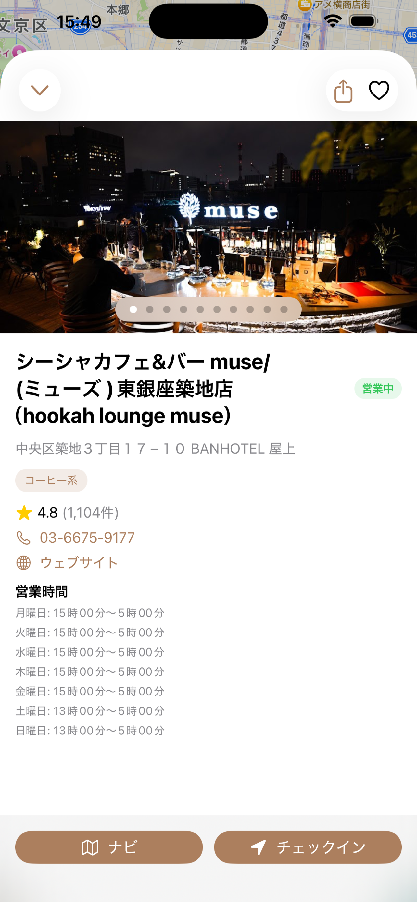
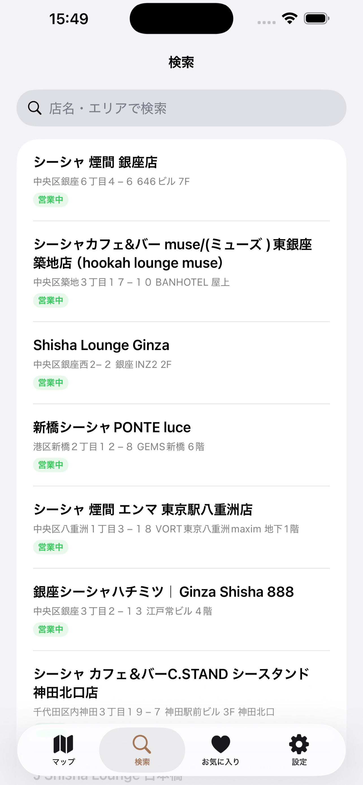
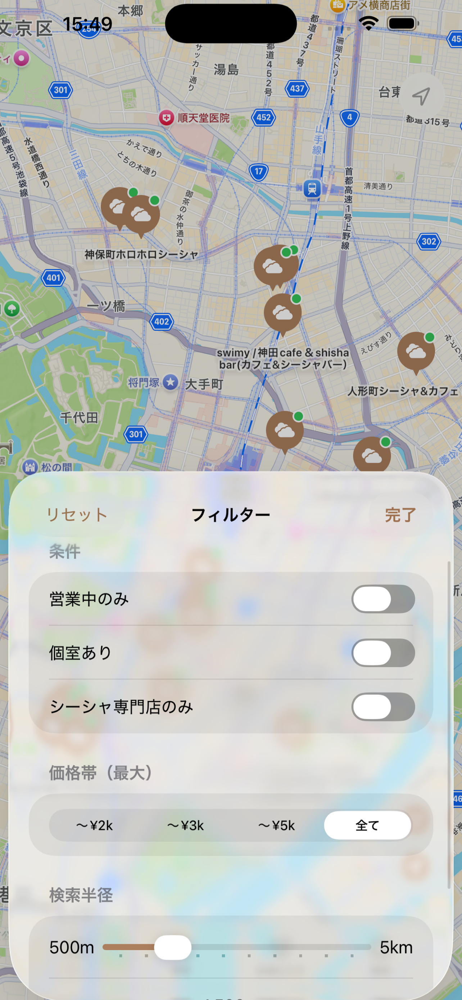

# ChillSpot

くつろげるカフェやラウンジをマップで発見できるiOSアプリ。

<p align="center">
  
  
  
  
  
</p>

## 作った背景

お気に入りのカフェやラウンジを探すとき、Googleマップでは目的に合わない店舗が大量にヒットしてしまい、自分好みの「くつろげる場所」を見つけるのに毎回手間がかかっていました。

**「自分だけのチルスポットを、シンプルにわかりやすく探せるアプリ」** を作ろうと思ったのが開発のきっかけです。

## 機能

- **マップ表示** — 現在地周辺のお店をピンで表示、クラスタリング対応
- **検索・フィルター** — キーワード検索、エリア検索、営業中・個室・価格帯などで絞り込み
- **リアルタイム検索** — テキスト入力に応じて即座に店舗候補を表示
- **店舗詳細** — 写真、営業時間、フレーバータグ、評価、電話・Webリンク
- **お気に入り・チェックイン** — 気になる店を保存、訪問記録をメモ付きで管理
- **オフライン保存** — お気に入り・チェックイン履歴はすべてローカル保存
- **設定** — プライバシーポリシー・利用規約・ライセンス表示・データ管理

## 技術スタック・選定理由

| 項目 | 技術 | 選定理由 |
|---|---|---|
| UI | SwiftUI | 宣言的UIでコードの見通しがよく、少ないコード量でリッチなUIを構築できるため |
| アーキテクチャ | MVVM (`@Observable`) | View・ロジック・データの責務を明確に分離し、テスタビリティを確保するため |
| データ永続化 | SwiftData | Core Dataより少ない記述量でSwiftネイティブにモデルを定義でき、SwiftUIとの統合がシームレスなため |
| 地図 | MapKit | Apple純正フレームワークで追加コストなく地図機能を実装でき、SwiftUIとの親和性が高いため |
| 位置情報 | CoreLocation | 現在地取得・ジオコーディングなどiOS標準の位置情報機能を活用するため |
| 外部API | Google Places API (REST) | 店舗の写真・営業時間・レビューなど豊富なデータを取得でき、Apple MapKitだけでは取得できない情報を補完するため |
| 最小ターゲット | iOS 17.0 | `@Observable` マクロやSwiftDataなどiOS 17以降のAPIをフル活用するため |

## アーキテクチャ

```
View (SwiftUI)
 │  ユーザー操作
 ▼
ViewModel (@Observable)
 │  データ取得・ビジネスロジック
 ▼
Repository (Protocol)
 ├── PlacesRepository  ← Google Places API
 └── MockRepository    ← プレビュー・テスト用
 │
 ▼
SwiftData (ローカル永続化)
 └── Store / CheckIn / FilterCriteria
```

- **Repository Pattern** を採用し、データ取得元をProtocolで抽象化。本番APIとモックを差し替え可能にすることで、テストやSwiftUI Previewを容易にしました。

## 開発で苦労した点・工夫した点

### 1. Google Places APIキーの管理

APIキーをソースコードに直接書いてしまうとGitHubに公開された際に漏洩するリスクがあります。`Secrets.xcconfig` に分離し `.gitignore` で除外、`Info.plist` 経由で読み込む方式を採用しました。チーム開発を想定して `Secrets.xcconfig.example` をテンプレートとして同梱し、セットアップ手順も整備しています。

### 2. マップスクロール時のAPI呼び出し制御

マップをスクロールするたびにAPIリクエストが発生すると、レスポンスが重くなるだけでなくAPI利用料金も増大します。**デバウンス処理**（一定時間操作が止まるまでリクエストを遅延）を実装し、不要なAPI呼び出しを抑制しました。加えて近距離（100m以内）の再取得スキップとキャッシュ機構を導入し、UXとコストの両面を改善しています。

### 3. リアルタイム検索の実装

Google Places Text Search APIを活用し、テキスト入力に応じてリアルタイムに店舗候補を表示する機能を実装しました。デバウンス処理（0.5秒）とキャッシュ（5分間）を組み合わせ、API呼び出し回数を最小限に抑えつつ、ユーザーにはスムーズな検索体験を提供しています。

### 4. App Store審査対応（現在進行中）

App Storeへの申請ではリジェクトを経験し、審査ガイドラインへの準拠に苦戦しています。プライバシーポリシーの作成・公開、Privacy Nutrition Labelの設定、ATSの確認、入力値バリデーションの強化など、コードを書く以外の部分で多くの対応が必要でした。「アプリを作る」だけでなく「リリースする」ことの難しさを実感しています。

### 5. セキュリティ対策

個人開発だからといってセキュリティを軽視せず、以下の対策を実施しました：
- 入力値のバリデーション強化（長さ制限・サニタイズ・URLスキームホワイトリスト）
- SwiftDataのData Protection属性設定・バックアップ除外
- Force Unwrapの排除による実行時クラッシュリスクの低減
- os.Loggerを用いたログレベル制御（機密情報のマスキング）

### 6. Issue駆動開発

全機能・バグ修正・リファクタリングをGitHub Issueで管理し、ブランチ → PR → マージのフローで開発を進めました。Issue数は60件以上、うち40件以上をクローズしています。個人開発でもチーム開発を意識したワークフローを実践しました。

## 今後の課題

- App Storeリリース（審査対応中）
- CI/CDパイプラインの構築
- UIテスト・統合テストの追加
- 画像キャッシュの最適化
- 多言語対応

## プロジェクト構成

```
ShishaMap/
├── Features/          # 画面ごとのView
│   ├── Map/           # マップ画面
│   ├── Search/        # 検索・フィルター
│   ├── Detail/        # 店舗詳細
│   ├── Favorites/     # お気に入り
│   ├── History/       # チェックイン履歴
│   ├── Settings/      # 設定・ライセンス
│   ├── Onboarding/    # 初回起動
│   └── Launch/        # スプラッシュ画面
├── Models/            # SwiftDataモデル・値型
├── ViewModels/        # StoreViewModel
└── Repositories/      # データアクセス層（Protocol + 実装）
```

## セットアップ

1. リポジトリをクローン
   ```
   git clone https://github.com/youishikawa0718-cpu/ShishaMap.git
   cd ShishaMap
   ```

2. APIキーの設定
   ```
   echo 'PLACES_API_KEY = YOUR_API_KEY_HERE' > ShishaMap/Secrets.xcconfig
   ```
   `YOUR_API_KEY_HERE` を [Google Cloud Console](https://console.cloud.google.com/) で取得した Places API キーに置き換えてください。

   > **注意**: `Secrets.xcconfig` は `.gitignore` で除外されているため、リポジトリには含まれません。

3. Xcode でプロジェクトを開く
   ```
   open ShishaMap.xcodeproj
   ```

4. ビルド & 実行
   - Scheme: **ShishaMap**
   - Destination: **iPhone 17**（iOS 26.3）
   - `Cmd + R` でビルド & 実行

## プライバシー

- 位置情報は店舗の検索にのみ使用し、外部サーバーには送信しません
- すべてのユーザーデータ（お気に入り・チェックイン）は端末内にのみ保存されます
- [プライバシーポリシー](https://youishikawa0718-cpu.github.io/ShishaMap/privacy-policy.html)

## ライセンス

© 2026 Yuki Ishikawa
